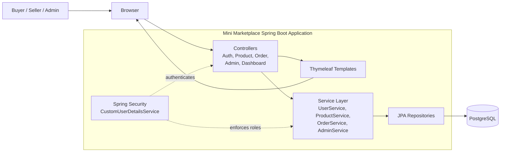
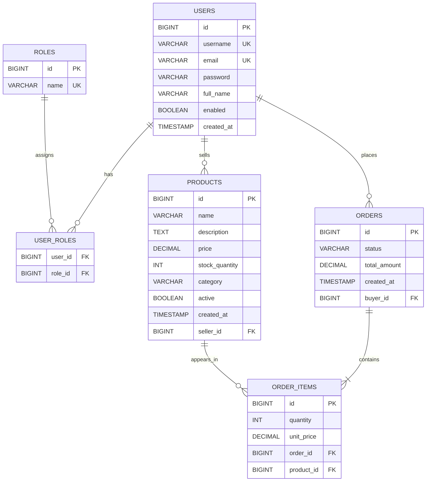

# Mini Marketplace

Mini Marketplace is a role-based marketplace application built with Spring Boot and Thymeleaf. Buyers can browse active products and place orders, sellers can manage their own listings, and admins can monitor users, products, and orders from a dedicated dashboard. The application uses Spring Security for authentication and authorization, JPA/Hibernate for persistence, PostgreSQL for normal runtime data, H2 for tests, Docker for containerized runs, and GitHub Actions for continuous integration.

## Project Description

This project is organized around three user roles:

- `BUYER` users browse the catalog, place orders, and track their own purchases.
- `SELLER` users create, update, and soft-delete their own products.
- `ADMIN` users review users, products, and orders, update order status, and manage marketplace activity.

Core behaviors already implemented in the codebase include:

- public product browsing with optional keyword and category filtering
- user registration with role selection for `BUYER` or `SELLER`
- seller-owned product management
- buyer order placement with stock validation and stock deduction
- admin dashboard APIs for users, products, orders, and summary stats
- server-rendered UI with Thymeleaf templates plus REST endpoints for the same domain areas

## Tech Stack

- Backend: Java 17, Spring Boot 3, Spring MVC, Spring Security, Spring Data JPA
- Frontend: Thymeleaf templates, HTML, CSS
- Database: PostgreSQL for the main app, H2 for the test profile
- Build tool: Maven Wrapper
- Containers: Docker, Docker Compose
- CI: GitHub Actions

## Architecture Diagram



The application serves both server-rendered pages and JSON responses. Controllers coordinate incoming requests, the service layer holds business rules such as stock validation and order status changes, repositories handle persistence, and Spring Security protects role-sensitive routes.

## ER Diagram



The `user_roles` table is created from the `@ManyToMany` mapping between users and roles. Product deletion in the application is implemented as a soft delete by setting `active = false`, so products remain in the database even after they are removed from the active catalog.

## API Endpoints

The REST API uses the same session-based authentication as the web UI. Users log in through the form route at `/auth/login`, and protected API endpoints rely on that authenticated session. There is no separate REST login endpoint in the current codebase.

All JSON endpoints return the shared `ApiResponse<T>` wrapper:

```json
{
  "success": true,
  "message": "Products retrieved",
  "data": []
}
```

Common API error statuses handled by the global exception layer are:

- `400 Bad Request` for validation failures or invalid arguments
- `401 Unauthorized` when authentication is required
- `403 Forbidden` when the user lacks permission
- `404 Not Found` when a resource does not exist
- `409 Conflict` for duplicate registration data
- `422 Unprocessable Entity` for insufficient stock
- `500 Internal Server Error` for unexpected failures

### Auth

| Method | Path | Access | Purpose |
| --- | --- | --- | --- |
| `POST` | `/auth/api/register` | Public | Register a new `BUYER` or `SELLER` account. |

### Products

| Method | Path | Access | Purpose |
| --- | --- | --- | --- |
| `GET` | `/products/api` | Public | List active products, with optional `keyword` or `category` query filters. |
| `GET` | `/products/api/{id}` | Public | Fetch one product by id. |
| `POST` | `/products/api` | `SELLER` | Create a new product owned by the logged-in seller. |
| `PUT` | `/products/api/{id}` | `SELLER` | Update a seller-owned product. |
| `DELETE` | `/products/api/{id}` | `SELLER` | Soft-delete a seller-owned product by marking it inactive. |

### Orders

| Method | Path | Access | Purpose |
| --- | --- | --- | --- |
| `POST` | `/orders/api` | `BUYER` | Place an order and deduct stock for each requested item. |
| `GET` | `/orders/api/my` | `BUYER` | Retrieve the logged-in buyer's orders. |
| `GET` | `/orders/api/{id}` | `BUYER` / `ADMIN` | Retrieve one order by id. |

### Admin

| Method | Path | Access | Purpose |
| --- | --- | --- | --- |
| `GET` | `/admin/api/users` | `ADMIN` | List all users. |
| `GET` | `/admin/api/products` | `ADMIN` | List all products, including inactive ones. |
| `GET` | `/admin/api/orders` | `ADMIN` | List all orders. |
| `PATCH` | `/admin/api/orders/{id}/status` | `ADMIN` | Update an order status using the `status` query parameter. |
| `DELETE` | `/admin/api/orders/{id}` | `ADMIN` | Permanently delete an order. |
| `DELETE` | `/admin/api/products/{id}` | `ADMIN` | Soft-delete a product by marking it inactive. |
| `GET` | `/admin/api/stats` | `ADMIN` | Fetch dashboard totals for users, products, orders, and active products. |

### Request and Response Shapes

Registration request for `POST /auth/api/register`:

```json
{
  "username": "seller01",
  "email": "seller@example.com",
  "password": "secret123",
  "fullName": "Seller Name",
  "role": "SELLER"
}
```

Product create or update request for `POST /products/api` and `PUT /products/api/{id}`:

```json
{
  "name": "Wireless Mouse",
  "description": "Compact mouse for everyday use",
  "price": 25.50,
  "stockQuantity": 40,
  "category": "Accessories"
}
```

Order placement request for `POST /orders/api`:

```json
{
  "items": [
    {
      "productId": 1,
      "quantity": 2
    }
  ]
}
```

The admin order status endpoint expects a `status` query parameter. Valid status values in the codebase are `PENDING`, `CONFIRMED`, `SHIPPED`, `DELIVERED`, and `CANCELLED`.

## Run Instructions

### Prerequisites

- Java 17
- Docker Desktop or Docker Engine with Compose support
- A PostgreSQL instance if you want to run the app locally without Docker Compose

### Configuration

The repository includes an example properties file at `src/main/resources/application.properties.example`.

1. Copy it to `src/main/resources/application.properties`.
2. Update the datasource credentials for your local PostgreSQL instance.
3. Keep `server.port=8080` unless you have a reason to change it.

For Docker Compose runs, the app receives datasource settings from environment variables, so you do not need to hand-edit local database credentials just to start the containers.

### Run with Maven

This option expects PostgreSQL to already be available using the values from your `application.properties`.

Unix-like shells:

```bash
./mvnw clean install
./mvnw spring-boot:run
```

Windows PowerShell:

```powershell
.\mvnw.cmd clean install
.\mvnw.cmd spring-boot:run
```

Once the application starts, open `http://localhost:8080`.

### Run with Docker Compose

The Compose setup starts:

- the Spring Boot application on port `8080`
- a PostgreSQL 15 container on port `5432`
- a database named `minimarketplace`

Run:

```bash
docker compose up --build
```

If your setup still uses the legacy Compose command, `docker-compose up --build` works as well.

Stop the stack with:

```bash
docker compose down
```

### Testing

The automated tests use the `test` profile and an in-memory H2 database.

Unix-like shells:

```bash
./mvnw test
```

Windows PowerShell:

```powershell
.\mvnw.cmd test
```

You can also run tests in a Maven container:

```powershell
docker run --rm -v "${PWD}:/app" -w /app maven:3.9-eclipse-temurin-17 mvn test
```

This project is configured around Java 17, and the CI pipeline also uses JDK 17.

## CI/CD Explanation

### CI

The repository already includes a GitHub Actions workflow at `.github/workflows/ci.yml`.

Current CI behavior:

- triggers on pushes to `main`
- triggers on pull requests targeting `main`
- runs on `ubuntu-latest`
- sets up Temurin JDK 17
- caches Maven dependencies
- runs `./mvnw -B clean test`
- uploads Surefire test reports as workflow artifacts

This keeps the main branch guarded by the same build-and-test flow used in the repository.

### CD

Continuous delivery is handled through Render. The GitHub repository is connected to a Render web service, and Render builds and deploys the application using this project's `Dockerfile`. When new changes are pushed to the connected branch, Render redeploys the latest version of the service.

Live application URL:

- `https://software-lab-mini-marketplace.onrender.com`

This keeps the application publicly accessible while CI remains in GitHub Actions and deployment is handled by Render.

## Project Structure

- `src/main/java/com/jahid/minimarketplace/controller` - MVC and REST controllers
- `src/main/java/com/jahid/minimarketplace/service` - business logic and startup role seeding
- `src/main/java/com/jahid/minimarketplace/repository` - JPA repositories
- `src/main/java/com/jahid/minimarketplace/entity` - persistence model
- `src/main/java/com/jahid/minimarketplace/config` - security configuration
- `src/main/resources/templates` - Thymeleaf views for auth, products, orders, and admin pages
- `.github/workflows/ci.yml` - CI workflow
- `Dockerfile` and `docker-compose.yml` - container build and local multi-container setup
